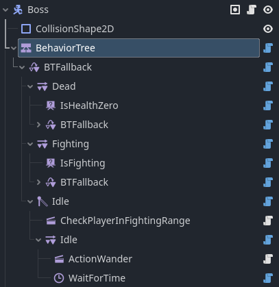
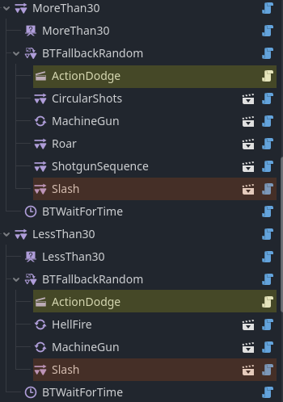
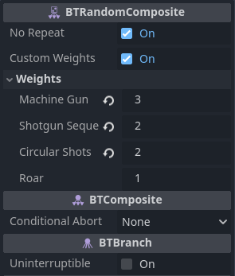
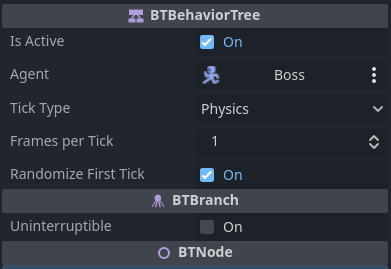
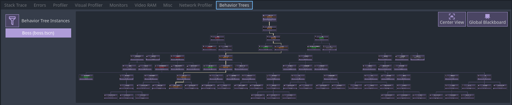

# Dissonant Void's Behavior Tree
A modular behavior tree implementation addon for Godot 4, with a user-friendly, extendable system allowing for adaptive AI that reacts to its environment and performs many actions without the code turning spagetti with each iteration.\
With this addon you can make complex NPCs to populate your world, or bosses that can go through multiple phases with the combination of simple actions and flow control.

> [!NOTE]
> This addon started as a small project for personal use to implement features I couldn't find in other BT addons (mainly interruption related) but had grew enough to be worth sharing with the community.

  

## Easy to setup and use
Setup tree structure easily using nodes.

## Modular system
Bahavior trees are highly scalable by design, allowing for iterable design where nodes are added, removed and even reused to reach a complex AI one step at a time.

## Customization and fine-tuning
Built-in nodes offer customization whenever possible, and if you need evern more control extend any class and make your own!

## Debugger
A powerful and optimized debugger that allows for viewing active behavior trees, their decision making and variables in real-time. It also offsers debugging tools.

# Examples
## Showcase
> [!NOTE]
> If you've made a game or a tutorial that uses this addon, feel free to reach out and I could mention it here.

## Examples
[Official begginers guide](./addons/DVs_behavior_tree/docs/(3)%20your%20first%20behavior%20tree.md).\
Small example scenes that cover a range of use cases are included with the addon in `examples/`, please read `examples/readme_first.txt`.

# Documentations
If you are new to behavior trees or wish to refresh your knowledge of how they work [start here](./addons/DVs_behavior_tree/docs/(1)%20start%20here.md).\
Documentation of this addon and its features [can be found here](./addons/DVs_behavior_tree/docs/(2)%20using%20addon.md).

# Help
## Roadmap
[Milestones](https://github.com/DissonantVoid/DVs-Behavior-Tree/milestones).\
Code related smaller tasks can be found in code by searching for "TODO"s.
## Contribution
Please see [contribution](addons/DVs_behavior_tree/docs/contribution.md).

# Credits
## Socials
[Xhitter](https://twitter.com/Dissonant_Void).

[Instagram](https://www.instagram.com/dissonant_void/).

[Itch io](https://x-void-x.itch.io).

[Discord Profile](https://discordapp.com/users/1109492493197787206).